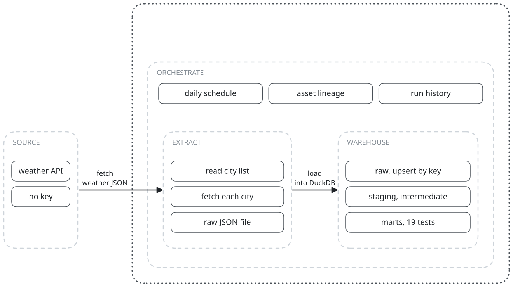
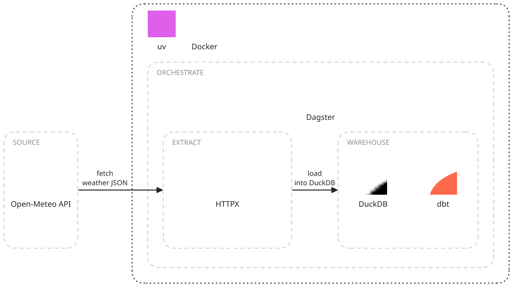

# data-orchestrator

Weather pipeline: Dagster pulls Open-Meteo data for four cities into DuckDB and builds tested dbt marts.

Status: working · learning build · 2026-10



## What it does

Compares the weather of four cities over a two-week window. It gives daily metrics per city
and ranks the cities by warmth, rain, wind and humidity.

## How it works

1. **Source.** The Open-Meteo forecast API, no key. Each call returns 7 past days and
   7 forecast days, hourly and daily: temperature, humidity, precipitation, wind.
2. **Orchestrate.** Dagster runs the three assets as one job, `daily_weather_pipeline`. Its
   schedule (06:00 UTC) ships stopped; turn it on in the UI, which shows lineage and run history.
3. **Extract.** `raw_weather_data` reads the cities from `config/cities.yml`, fetches each
   with HTTPX, and writes one JSON file per run to `data/raw/`.
4. **Warehouse.** `staged_weather_data` upserts the newest file into DuckDB, keyed by city and
   time. `dbt build` then runs staging, intermediate and marts, with 19 tests.

## Tech stack



## Results

City comparison from the run extracted 2025-12-31, window 2025-12-24 to 2026-01-06
(the last 7 days are forecast), read from `fct_city_comparison`:

| City | Avg temp (°C) | Precipitation (mm) | Clear days | Warmest rank |
|------|--------------:|-------------------:|-----------:|-------------:|
| Dubai | 21.3 | 0.1 | 13/14 | 1 |
| Riyadh | 15.1 | 0.0 | 14/14 | 2 |
| London | 3.1 | 2.4 | 13/14 | 3 |
| New York | -0.8 | 19.8 | 8/14 | 4 |

## Run it

Needs [uv](https://docs.astral.sh/uv/). Python 3.11 is pinned in `.python-version`.

```sh
uv sync
uv run dagster dev    # UI on localhost:3000: materialize all assets
```

The warehouse lands in `data/warehouse/weather.duckdb`. Docker setup: [docs/docker.md](docs/docker.md).

## Layout

```
dagster_project/   assets (extract, load, dbt), resources, the daily schedule
dbt_project/       staging, intermediate and marts models with their tests
config/            the city list
data/              raw JSON and the DuckDB file (contents gitignored)
docs/              configuration, dbt models, Docker, diagrams
```

## Docs

- [docs/configuration.md](docs/configuration.md): cities, the schedule, the API window, file paths.
- [docs/dbt-models.md](docs/dbt-models.md): every model by layer, and the 19 tests.
- [docs/docker.md](docs/docker.md): the two Compose services and their commands.
- [docs/diagrams/diagrams.py](docs/diagrams/diagrams.py): the scene script behind both diagrams.
- [spec_data_orchestrator.md](spec_data_orchestrator.md): the plan written before the build.
  Where it and the code differ, the code is right.
